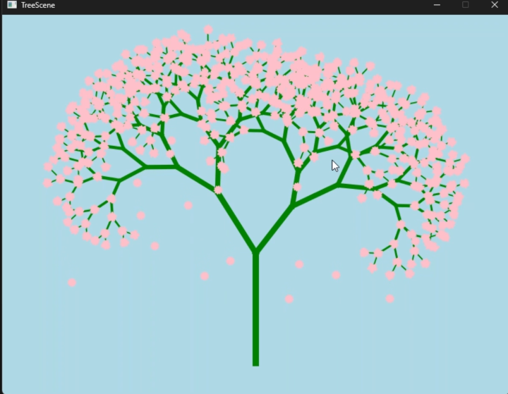

  <h1>Anime_Template</h1>

这是一个集合了各种 QWidget 控件的模板，展示了从分形到交互式波等多种炫酷效果，和基础的控件。

| 主题 | 图片 | 描述 | 文件名 | 跳转链接 |
| :----------------------- | :------------------------------------------------------------------------------------------------------------------------------------------------------------------------------------------------------------------------------------------------ | :--------------------------------------- | :--------------- | :--------------------- |
| 《QWidget--分形》迭代型分形们 |  | 演示迭代型分形的生成与展示。 | `FractalWidget` | [bilibili小部件演示](https://www.bilibili.com/video/BV12aKtzdErC) |
| 《QWidget交互波》 |  | 展示波浪或水波纹效果的动态视图。 | `Wave` | [bilibili小部件演示](https://www.bilibili.com/video/BV1kETHzNERE) |
| 《QWidget轮播图》轮播图 |  | 实现基础的轮播图效果，用于图片或内容展示。 | `Carousel_card` | [bilibili小部件演示](https://www.bilibili.com/video/BV1ksZdYjE3w) |
| 《QWidget按钮 》 波纹和波浪 |  | 按钮点击时带有波纹或波浪动画效果。 | `button_class` | [bilibili小部件演示](https://www.bilibili.com/video/BV12fdFYZEsk) |
| 《QWidget登录页面 》 登录注册效果 |  | 响应式登录注册页面，可能包含动画效果。 | `Login_interface` | [bilibili小部件演示](https://www.bilibili.com/video/BV18FdjYVEBN) |
| 《QWidget旋钮》 渐变旋钮控件 |  | 一个带有渐变色彩的自定义旋钮控件。 | `dial_class` | [bilibili小部件演示](https://www.bilibili.com/video/BV1dTdSY2Ef1) |
| 《QWidget轮播图》椭圆无限滚动滑动轮播图 |  | 高级轮播图，实现椭圆轨迹的无限滚动。 | `Adaptive_Carousel` | [bilibili小部件演示](https://www.bilibili.com/video/BV1AXonY7EPz) |
| 《QWidget蟑螂须》拉链滑块控件 |  | 独特设计的拉链式滑块控件。 | `Zipper_Slider` | [bilibili小部件演示](https://www.bilibili.com/video/BV1DWLbzWEjd) |
| 《QWidget拟态化按钮》 |  | 具有拟态设计风格的按钮。 | `Mimic_Button` | [bilibili小部件演示](https://www.bilibili.com/video/BV1yXGrz3E6g) |
| 《QWidget交融动画按钮》 |  | 按钮点击或交互时呈现液态交融动画。 | `Liquid` | [bilibili小部件演示](https://www.bilibili.com/video/BV1w25PzBEq3) |
| 《QWidget流动渐变字》 |  | 文字带有流动渐变效果的展示。 | `Flowing_Gradient_Font` | [bilibili小部件演示](https://www.bilibili.com/video/BV1fLEgzoEdW) |
| 《QWidget像素过渡》 |  | 像素化的过渡动画效果。 | `PixelTransition` | [bilibili小部件演示](https://www.bilibili.com/video/BV1Km7Kz4EyF) |
| 《QWidget线条动画》 |  | 生成式线条动画，创造动态视觉效果。 | `Generative_Lines` | [bilibili小部件演示](https://www.bilibili.com/video/BV1W27mzMEmK) |
| 《QWidget简易点浪动画》 |  | 简单的点状波浪动画。 | `Point_Wave` | [bilibili小部件演示](https://www.bilibili.com/video/BV1vhTJzEEPT) |
| 《QWidget故障文本》 |  | 模拟故障或数字失真效果的文本展示。 | `Glitch_Text` | [bilibili小部件演示](https://www.bilibili.com/video/BV1nyT3zqEbW) |
| 《QWidget物理文本》物理模拟 |  | 文本具有物理模拟效果，如碰撞、重力等。 | `Physical_Text` | [bilibili小部件演示](https://www.bilibili.com/video/BV1zRTBzyEZB) |
| 《QWidget文本动画》 翻转弹性 |  | 文本字符可以进行翻转或弹性动画。 | `SplitText` | [bilibili小部件演示](https://www.bilibili.com/video/BV1kvMmzVEbb) |
| 《QWidget压力方块》 压力方块 |  | 模拟压力或形变的方块效果。 | `Pressure_Block` | [bilibili小部件演示](https://www.bilibili.com/video/BV1VSN4zaEWK) |
| 《QWidget模糊文本》模糊文本 |  | 文字具有模糊效果，可用于过渡或强调。 | `Blur_Text` | [bilibili小部件演示](https://www.bilibili.com/video/BV1prKNzHExz) |
| 《QWidget二叉花树》 二叉花树 |  | 二叉树的形成和节点上花的形成，花的凋落 | `Blur_Text` | [bilibili小部件演示](https://www.bilibili.com/video/BV1Q7KZzmEAw) |
