---

## Anime_Template - QWidget 动画与控件精选

这是一个集合了各种 QWidget 动画与控件的模板列表，展示了从分形艺术到交互式按钮等多种炫酷效果。

| 主题 | 图片 | 描述 | 文件名/跳转链接 (待补充) |
| :----------------------- | :----------------------------------------- | :--------------------------------------- | :--------------------- |
| 《QWidget--分形》迭代型分形们 | 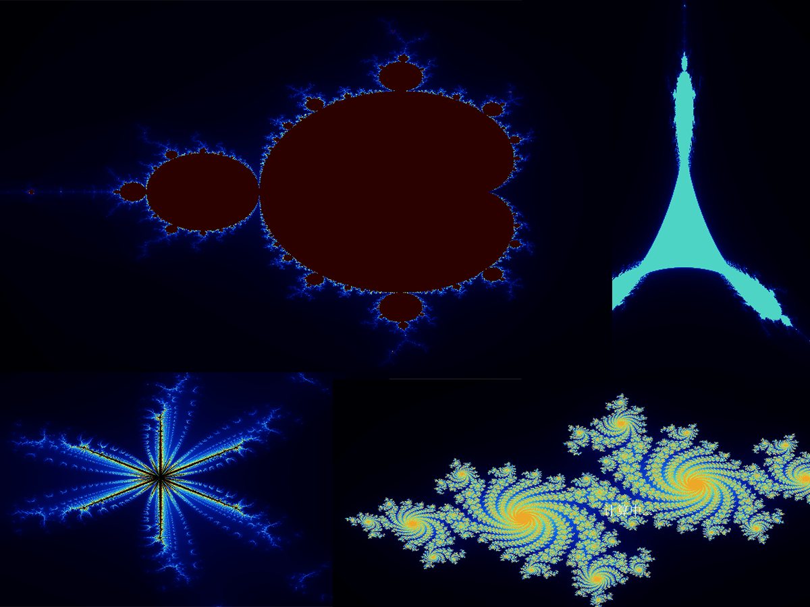 | 演示迭代型分形的生成与展示。 | FractalWidget |
| 《QWidget波》 | 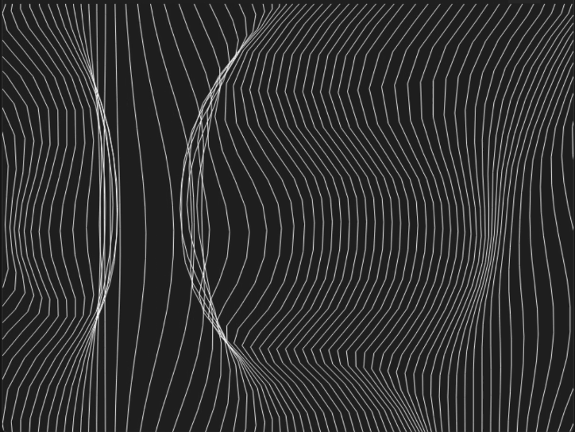 | 展示波浪或水波纹效果的动态视图。 | Wave |
| 《QWidget轮播图》轮播图 | 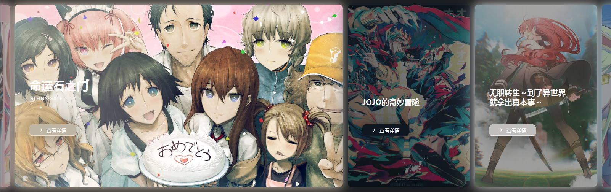 | 实现基础的轮播图效果，用于图片或内容展示。 | Carousel_card |
| 《QWidget按钮 》 波纹和波浪 | 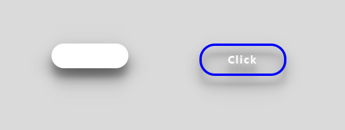 | 按钮点击时带有波纹或波浪动画效果。 | button_class |
| 《QWidget登录页面 》 登录注册效果 | 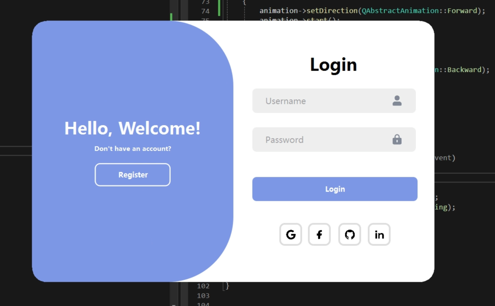 | 响应式登录注册页面，可能包含动画效果。 | Login_interface |
| 《QWidget旋钮》 渐变旋钮控件 |  | 一个带有渐变色彩的自定义旋钮控件。 | dial_class |
| 《QWidget轮播图》椭圆无限滚动滑动轮播图 | 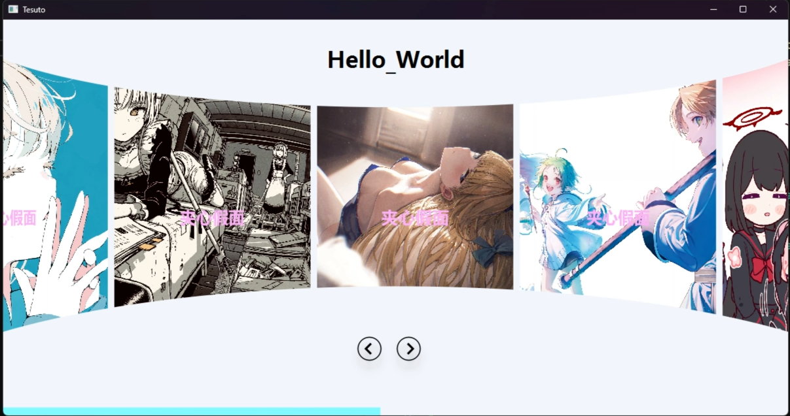 | 高级轮播图，实现椭圆轨迹的无限滚动。 | AdaptiQve_Carousel |
| 《QWidget蟑螂须》拉链滑块控件 | 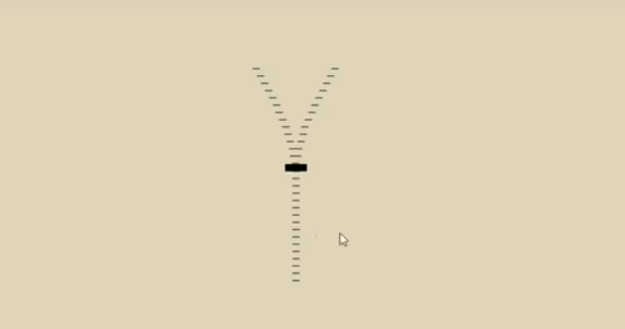 | 独特设计的拉链式滑块控件。 | Zipper_Slider |
| 《QWidget拟态化按钮》 |  | 具有拟态设计风格的按钮。 | Mimic_Button |
| 《QWidget交融动画按钮》 | 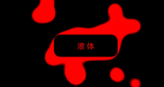 | 按钮点击或交互时呈现液态交融动画。 | Liquid |
| 《QWidget流动渐变字》 | 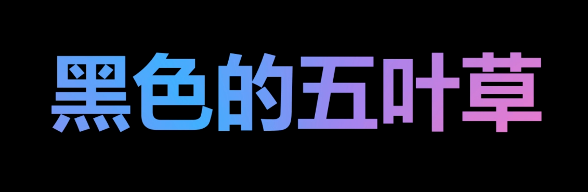 | 文字带有流动渐变效果的展示。 | Flowing_Gradient_Font |
| 《QWidget像素过渡》 | 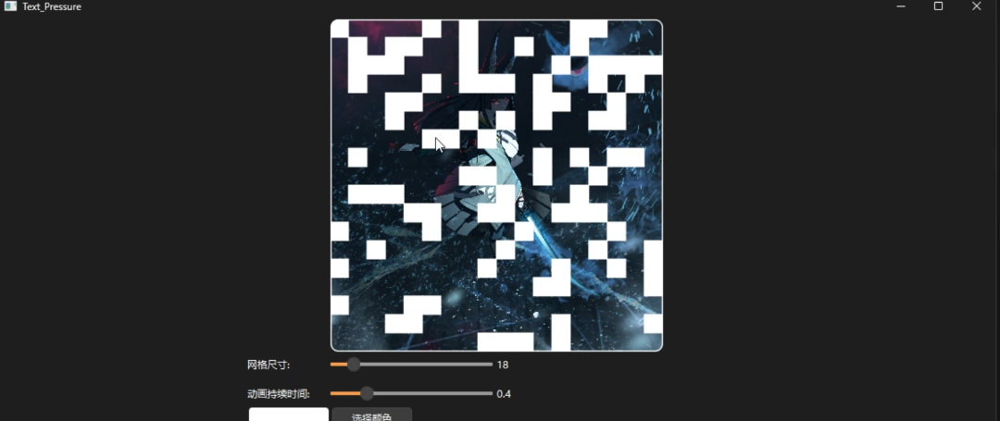 | 像素化的过渡动画效果。 | PixelTransition |
| 《QWidget线条动画》 | 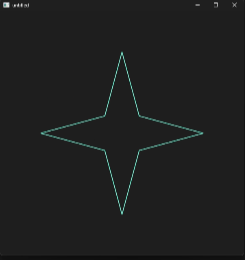 | 生成式线条动画，创造动态视觉效果。 | Generative_Lines |
| 《QWidget简易点浪动画》 | 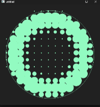 | 简单的点状波浪动画。 | Point_Wave |
| 《QWidget故障文本》 | 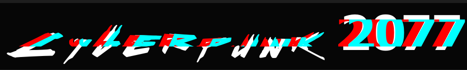 | 模拟故障或数字失真效果的文本展示。 | Glitch_Text |
| 《QWidget物理文本》物理模拟 | 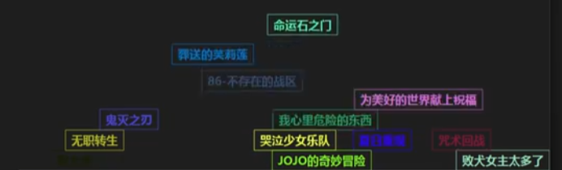 | 文本具有物理模拟效果，如碰撞、重力等。 | Physical_Text |
| 《QWidget文本动画》 翻转弹性 | 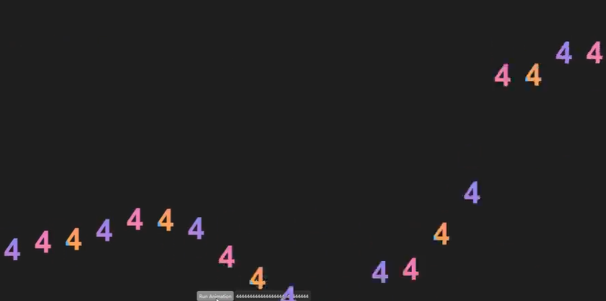 | 文本字符可以进行翻转或弹性动画。 | SplitText |
| 《QWidget压力方块》 压力方块 |  | 模拟压力或形变的方块效果。 | Pressure_Block |
| 《QWidget模糊文本》模糊文本 | 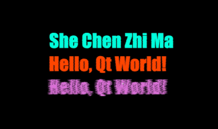 | 文字具有模糊效果，可用于过渡或强调。 | Blur_Text |
